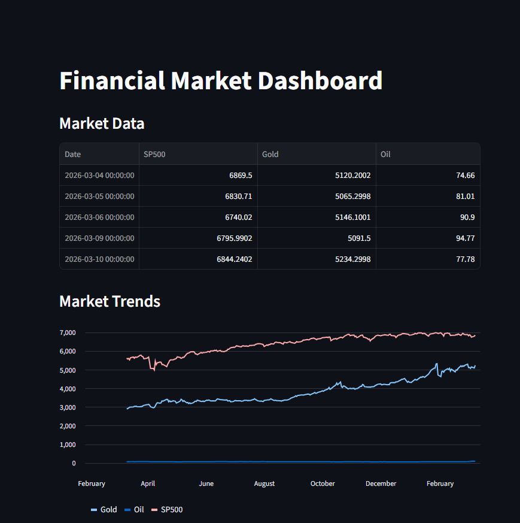
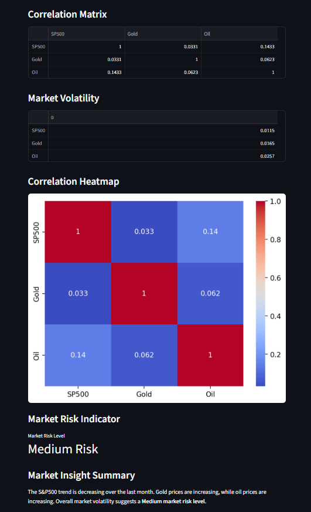

# Financial Market Data Analysis Dashboard

This project is a Python-based financial analytics system that automatically collects financial market data, performs analysis, and visualizes results through an interactive dashboard.

## Features

- Automated financial data collection using Yahoo Finance API
- Data preprocessing and cleaning
- Market volatility analysis
- Asset correlation analysis
- Interactive dashboard using Streamlit
- Market risk indicator
- Automated market insight summary

## Technologies Used

- Python
- pandas
- yfinance
- matplotlib
- seaborn
- streamlit

## Project Structure

data_fetch.py – downloads financial market data  
analysis.py – performs financial analysis and generates charts  
dashboard.py – interactive dashboard for visualization  

## How to Run the Project

1. Install required libraries

pip install -r requirements.txt

2. Download financial data

python data_fetch.py

3. Run analysis

python analysis.py

4. Start dashboard

python -m streamlit run dashboard.py

## Example Insights

The dashboard automatically generates insights such as:

- Market trend detection
- Correlation between financial assets
- Market risk level based on volatility

## Dashboard Preview

### Market Overview Dashboard

### Risk & Correlation Analysis

## Author

Dhruvi Gondaliya

